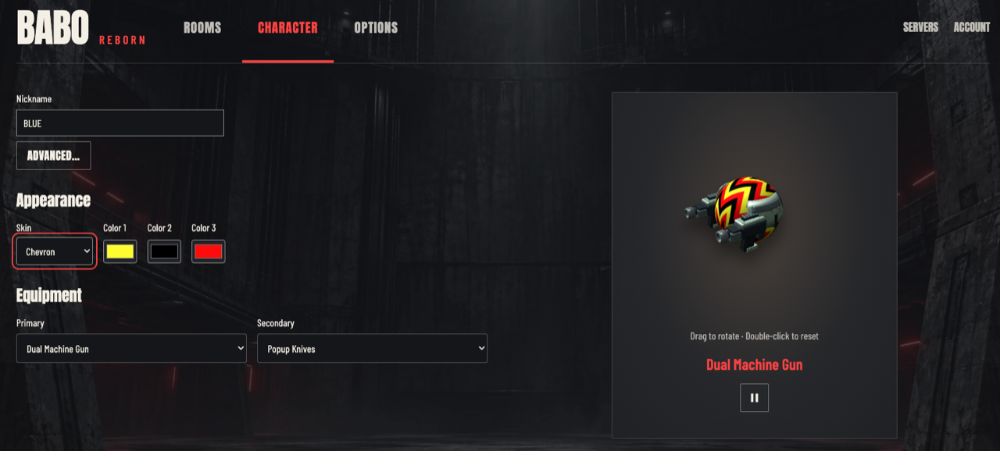

# BaboReborn

BaboReborn is a browser multiplayer arena shooter inspired by BaboViolent:
fast matches, responsive movement, and a worn, urban, cyberpunk style.

**[Play now at baboreborn.com](https://baboreborn.com/)**



## Gameplay

Development aims to preserve BaboViolent's movement, weapons, and pace in the browser.

Play Deathmatch, Team Deathmatch, or Capture the Flag. Rooms configure match
limits, respawns, bots, and map rotations. See the [gameplay guide](docs/GAMEPLAY.md)
for controls, weapons, and rules.

## Community servers

The [central portal](https://baboreborn.com/) lists community servers and rooms. Anyone can host a server,
connect it to the portal, and manage rooms. Players connect directly to the
community server for matches; hosting across regions lets them choose nearby servers.

### Host a community server

You need Git, Docker with Compose, a public hostname pointing to your host, a valid TLS
certificate, and an open TCP port (8443 by default). The server connects to
`https://baboreborn.com`; it stores its own state in SQLite and a persistent Docker volume.

1. Prepare the standalone Compose configuration:

   ```sh
   git clone https://github.com/pacoricci/BaboReborn.git
   cd BaboReborn/deploy/docker
   cp .env.example .env
   mkdir -p secrets/server
   ```

2. In `.env`, set `CENTRAL_ORIGIN=https://baboreborn.com` and choose `SERVER_PORT`
   (default `8443`). Set `SERVER_IMAGE` to the `baboreborn-server` image reference
   from a [GitHub Release](https://github.com/pacoricci/BaboReborn/releases)'s
   `images.txt`. The portal checks compatibility during association and reports
   required updates in **Manage servers**.

3. Place your hostname's certificate chain and private key in
   `secrets/server/fullchain.pem` and `secrets/server/privkey.pem`. The container
   runs as UID/GID `10001:10001`; grant it directory traversal and file read access.

4. Sign in to the portal and open **Manage servers** to register the server's
   name, region, and public origin, such as `https://game.example.org:8443`.
   Include the port if it is not 443. The pairing code expires after 15 minutes.
   Save it in `secrets/server/pairing-code`, readable by the container, and set
   `PAIRING_CODE_FILE=/run/config/pairing-code` in `.env`.

5. Start the server from `deploy/docker/`:

   ```sh
   ds() { docker compose --env-file .env -f compose.server.yaml "$@"; }
   ds config --quiet
   ds pull server
   ds up -d server
   ds logs --tail=100 server
   ```

6. Once the portal confirms association and public verification, clear
   `PAIRING_CODE_FILE` in `.env`, run `ds up -d server` again, and remove the
   consumed pairing-code file. Create rooms through server management, then
   verify that they appear in the portal and you can join a match.

Keep the `server-data` volume: it holds the installation identity, association,
and room settings. `docker compose down -v` deletes persistent volumes.
See the [deployment guide](docs/deployment/DEPLOYMENT.md) for TLS/proxy setup,
backups, updates, and troubleshooting.

## Run and contribute

- [Development](docs/development/DEVELOPMENT.md): prerequisites, local startup,
  and verification.
- [Deployment](docs/deployment/DEPLOYMENT.md): central and community hosting,
  association, and storage maintenance.
- [Architecture](docs/architecture/README.md): module ownership and data contracts.
- [Contributing](CONTRIBUTING.md): changes, bug reports, and asset attribution.
- [Security](.github/SECURITY.md): supported versions and private reporting.

Original BaboReborn code uses [GPL-3.0-or-later](LICENSE); original maps, art,
and audio use [CC BY-SA 4.0](https://creativecommons.org/licenses/by-sa/4.0/).
Third-party code and assets retain their respective notices and licenses; see
[Credits](CREDITS.md).

Not affiliated with RndLabs. BaboViolent is a trademark of its respective owners.
