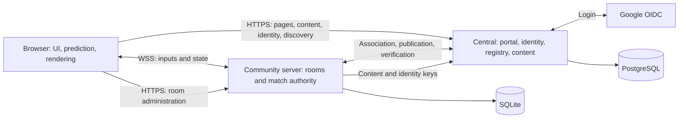

# Architecture

BaboReborn pairs a Go match authority with a TypeScript client using local
prediction, Solid UI, and Babylon.js rendering. Central and community servers
are separate executables and deployments.

## Ownership

| Area                      | Responsibility and entry points                                                                                                                                                                 |
| ------------------------- | ----------------------------------------------------------------------------------------------------------------------------------------------------------------------------------------------- |
| Central                   | [Entry point](../../backend/cmd/central/main.go); `backend/central/` owns accounts, sessions, server registration, and portal HTTP routes.                                                      |
| Community server          | [Entry point](../../backend/cmd/server/main.go); hosts rooms, validates central-issued identity, and applies local roles and sanctions.                                                         |
| Match authority           | `backend/server/match/` owns world state, rounds, participants, scores, CTF, bots, and hit history; `backend/core/` owns simulation primitives.                                                 |
| Room hosting              | `backend/server/hosting/` owns live rooms; `administration/` owns persisted configuration and authorized operations; `registration/` owns central association.                                  |
| Transport and replication | `backend/server/transport/` adapts HTTP/WebSocket and drives room ownership; `replication/` selects and retains deliveries; `wire/` captures and encodes them. See [networking](NETWORKING.md). |
| Browser application       | `frontend/src/apps/` owns application flows. Match session scheduling is independent of input, sockets, and rendering.                                                                          |
| Browser simulation        | `frontend/src/core/` simulates locally; `prediction/` reconciles checkpoints and interpolates remote state.                                                                                     |
| Browser adapters          | `network/` owns transport and parsing; `contracts/` defines application data; `presentation/` renders; `player/` owns shared preferences and appearance UI.                                     |

The room runtime serializes world and replication mutations. Socket writers send
requests and completions to that owner; they never mutate the world directly.

## Joining a match

1. Central serves the client, content, and verified room directory.
2. Accounts obtain access proofs through central using Google OIDC in production
   or `devcentral` locally. Guests use a browser-generated, community-scoped identifier.
3. The browser connects directly to the selected community server and authenticates.
4. The server checks admission and installs a baseline containing the arena,
   simulation cadence, recipient state, and event boundary.
5. The browser predicts local input; authority updates reconcile the local player
   and feed remote interpolation.

Server association is separate from login: an owner registers an origin and pairs
an installation. Central verifies its published state and compatibility before
listing it; the community retains local administration.

## Persistence and lifecycle

| Store                  | Durable state                                                                                                            |
| ---------------------- | ------------------------------------------------------------------------------------------------------------------------ |
| Central PostgreSQL     | Accounts, external identities, sessions, registered servers, pairing operations, registry nonces/events, and OIDC flows. |
| Central data directory | Signing key and public key set, process lease, and backups. A database dump does not preserve the signing key.           |
| Community SQLite       | Room configurations, roles, sanctions, administrative events, and installation association including its private key.    |
| Browser local storage  | Preferences, favorites, and other browser-owned state; never authoritative results or permissions.                       |

Live matches are not persisted: a restart reloads configured rooms. Central and
community stores require separate backups.

Each database has one complete schema baseline at version `1`:
[PostgreSQL](../../backend/central/storage/migrations/postgres/001_initial.sql) and
[SQLite](../../backend/server/storage/migrations/sqlite/001_initial.sql).
First startup requires an empty PostgreSQL database and fresh central and community
data directories. Initialization installs the baseline and its metadata in one
transaction. `schema_identity` identifies the application as `baboreborn`;
`schema_migrations` contains a single version record. Reopening a database validates
these values without applying SQL changes. Persistence takes exclusive leases and
rejects unrecognized or incompatible databases without converting them. Run
[maintenance operations](../deployment/DEPLOYMENT.md) with the owning service stopped.

## Repository and release boundaries

[Vite configuration](../../frontend/vite.config.ts) defines product entry points.
Release checks exclude development practice and workshops from product bundles
and administration imports from player entries. Central embeds the frontend and
content. Community images build independently of those assets; servers fetch
content from central.

## Changing the system

Keep Go and TypeScript gameplay parameters aligned; verify shared behavior with
conformance tests. Change contract producers, consumers, generated bindings, and
fixtures together. Protocol, API, identity, publication, content schema, tuning
profile, and database schema are separate compatibility boundaries.

HTTP calendar dates use RFC3339 UTC strings. Nullable dates stay `null` when unset
or permanent. Community SQLite stores Unix seconds; the HTTP boundary converts
them, including sanction expiries in audit details. Simulation ticks and elapsed
milliseconds remain numeric.

Data contracts follow these conventions:

- Instants: RFC3339 fields end in `At` (`expiresAt`); numeric instants end in
  `AtMs` with a documented clock, or in `Tick` for simulation ticks.
- Durations and angles name their unit (`respawnSeconds`, `timeLimitTicks`,
  `minSpreadDegrees`); tuning comments repeat it in brackets. Simulation fields
  document their units inline.
- Enumerations travel as lowercase codes (`dm`, `ctf`); display names belong to
  the interface ([mode names](../../frontend/src/contracts/mode.ts)).
- Entity references end in `Id` (`ownerId`, `mapId`, `serverId`); Go spells the
  same fields with `ID`. Account references keep role names (`owner`, `actor`,
  `target`) because they may also name principals such as `central`.
- Browser storage keys use `baboreborn.<area>.v<version>`, optionally followed by
  `:<scope>`. HTTP errors are JSON `{ "error": "snake_case_code" }`.

See [development](../development/DEVELOPMENT.md) for verification commands and
[gameplay](../GAMEPLAY.md) for rules.
